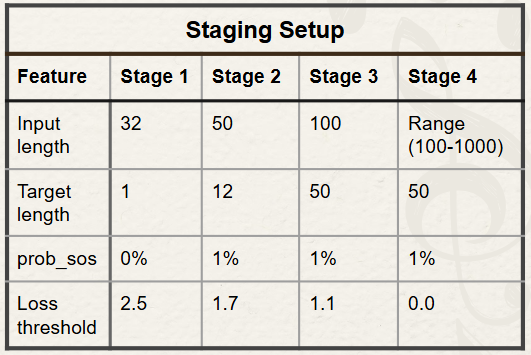

# MusicGen
This project uses a Recurrent Neural Network with Gated Recurrent Units and an attention mechanism to autoregressively generate music. Using this method we were able to generate original musical sequences with advanced rythmic structures. This project was completed by 3 undergraduate students for an advanced machine learning class at UW Stout. This project was completed over the course of 3 weeks and went through many iterations to achieve satasfactory results. 
 - Made by Emmett Jaakkola, Kyler Nikolai and Matthew Peplinski

## What is a RNN.
An [RNN](https://en.wikipedia.org/wiki/Recurrent_neural_network) is a machine learning architecture that accepts an arbitrary sized input. We used a 3 layer [GRU](https://en.wikipedia.org/wiki/Gated_recurrent_unit). We then applied attention to the final output. The goal of attention is to focus on previous outputs to give more context as to what the next output should be. Attention does this by calculating a separate context vector that weights outputs that are more relavent higher than outputs that are less relavent.

## Staging
During the training process, we found it helpful to train the model with different parameters over time. At the beginning of the training process, we had short sequences so that the model could quickly learn the basic rules of music. As the model became more accurate we made the sequences longer and gave the model more context. When the loss dips below the loss threshold, we transition to the next stage.



## Model Parameters
```
input_size   32
hidden_size  1028
num_layers   3
```

## Dataset and results
Initially, we trained our model on the [MAESTRO dataset](https://arxiv.org/abs/1810.12247), which resulted in satasfactory results when generating music completely from scratch. This is an example output using the MAESTRO dataset.
- [MAESTRO results](https://github.com/UW-Stout-ML/MusicGen/tree/main/music_gen_results/maestro_res_1.wav)


To explore different music generas we also trained our model on trained on the [Pop909 dataset](https://github.com/music-x-lab/POP909-Dataset). This POP09 model is the music_gen.pt final model uploaded. Here is an example from our final model trained on the POP909 dataset.
- [POP909 results](https://github.com/UW-Stout-ML/MusicGen/tree/main/music_gen_results/pop909_res_1.mp3)
  
To see if our model was generating songs from then dataset we fed in tokens of the begining of one of the songs in the dataset and compaired the output to the original song. It was able to create a non copied extention of the song. The top graph shows the note sequences for the seeded song, while the bottom shows the results from the models generation with the seeded segment.
- [POP909 test](https://github.com/UW-Stout-ML/MusicGen/tree/main/music_gen_results/pop909_sample.mp3)


### Pop909 Citation
@inproceedings{pop909-ismir2020,
    author    = {Ziyu Wang and Ke Chen and Junyan Jiang and Yiyi Zhang and Maoran Xu and Shuqi Dai and Xianbin Gu and Gus Xia},
    title     = {POP909: A Pop-song Dataset for Music Arrangement Generation},
    booktitle = {Proceedings of the 21st International Society for Music Information Retrieval Conference (ISMIR)},
    year      = {2020}
}

### MAESTRO Citation
Hawthorne, C., Stasyuk, A., Roberts, A., Simon, I., Huang, C. Z. A., Dieleman, S., Elsen, E., Engel, J., & Eck, D. (2019).  
**Enabling Factorized Piano Music Modeling and Generation with the MAESTRO Dataset.**  
*International Conference on Learning Representations (ICLR), 2019.*  
[https://arxiv.org/abs/1810.12247](https://arxiv.org/abs/1810.12247)
